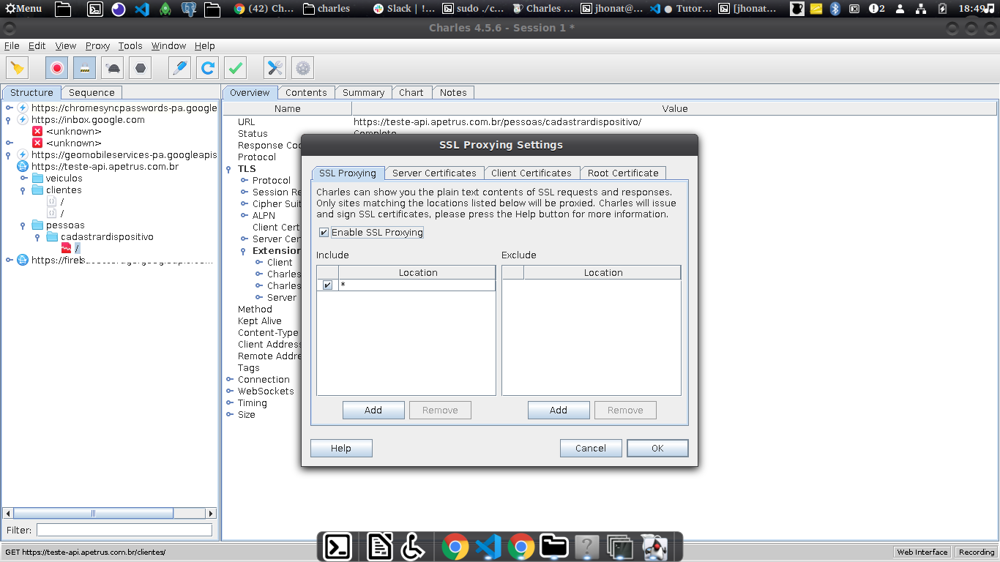
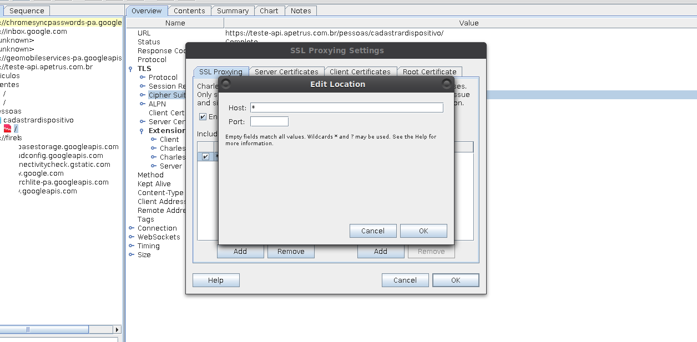
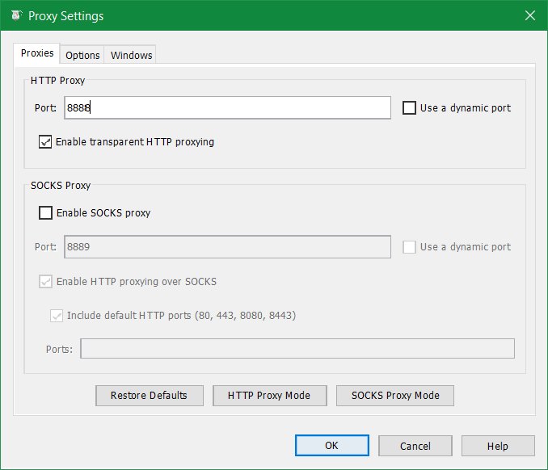
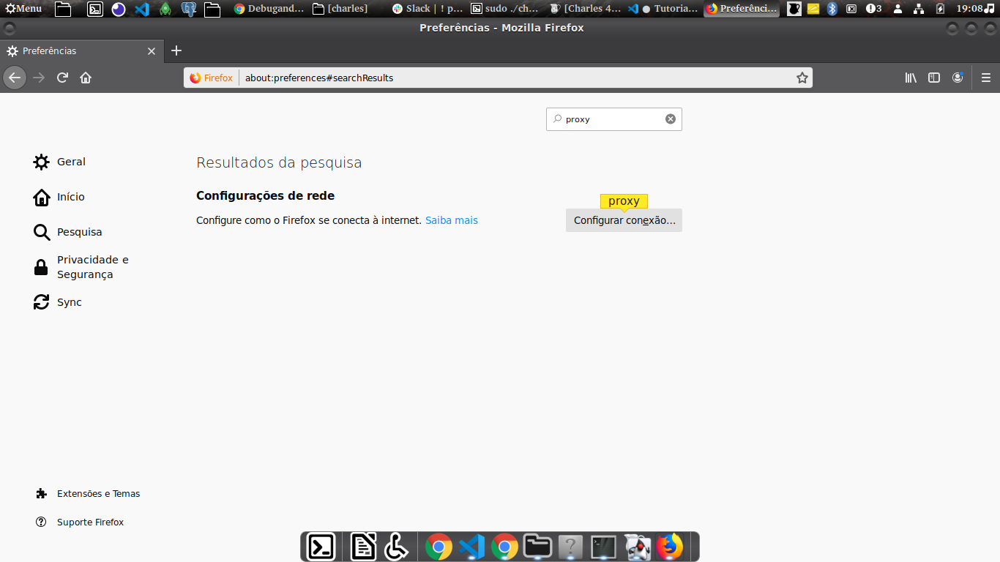
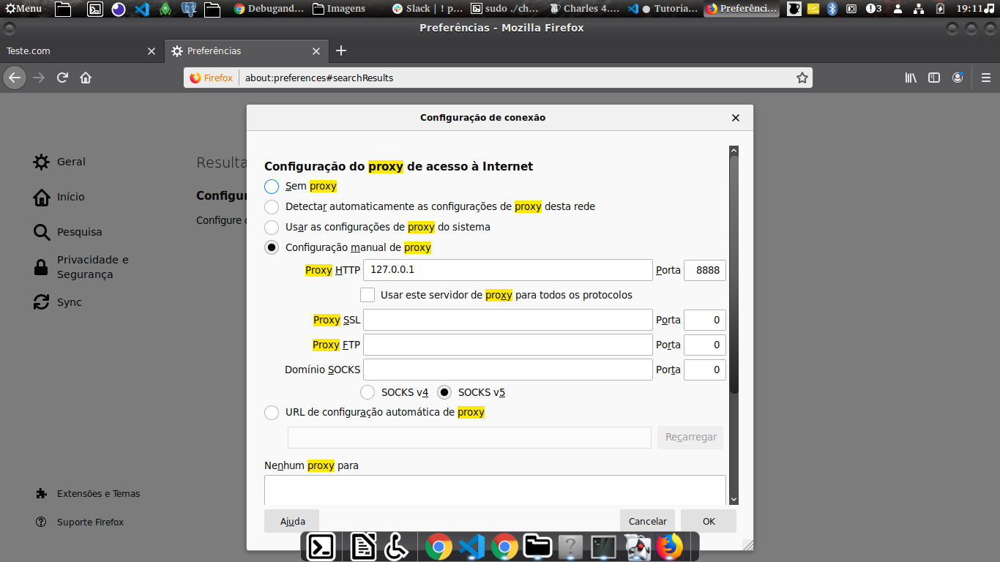
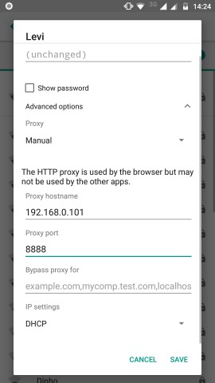
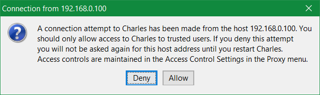
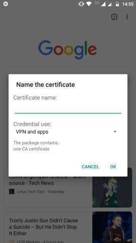

# instalação do charles

- primeiro vamos executar o cracker

  com seguinte comando

  ```
  java -jar CharlesCrock.jar
  ```

  anexamos o arquivo _charles.jar_ que estão na diretorio: **charles/charles/lib/charles.jar**

  em Register to: **FailedShack**

- agora vamos executar o Charles já com craker.

  vamos no diretorio
  **charles/charles/bin/**

  vamos dar permissão ao arquivos com comando:

  ```
  sudo chmod +x add-to-java-cacerts.sh
  ```

  ```
  sudo chmod +x charles
  ```

  executamos os arquivos nesta ordem:

  ```
  sudo ./add-to-java-cacerts.sh
  ```

  ```
  sudo ./charles
  ```

  pronto agora o Charles irá iniciar

# configurando Charles

- configurar o proxy SSL

  1. va na aba proxy
  2. SSL proxting Settings
     3 . coloque as configurações como na imagem abaixo

  

  4. Configurando dessa forma como mostra a figura abaixo

  

- Configurar porta do proxy

  1.  click em settings.
  2.  click em settings proxy
      irá se abrir uma janela como a da imagem em baixo.

  

  3. configure da forma que esta na imagem e click em _ok_.

  pronto as configurações do proxy esta finalizada.

  aconselho a não mecher mais em nada, pois pode te atrapalhar, foi o que aconteceu comigo.

# configurar firefox

1. click na aba do firefox e em seguida click em preferencias

- irá abrir ama janela de configurações como a foto abaixo.
- pesquise por proxy



2.  click no batão configurar conexão

- irá abrir a janela como na foto abaixo.



- configure manual, pois nem sempre as outras configurações funciona.

  - caso voce não saiba qual é seu ip, é so digitar

  ```
  ifconfig
  ```

  para linux

  ```
  ipconfig
  ```

  para windows

- pronto esta configurado, agora você já irá ver as requisições segando no Charles

# Configurar Mobile

- primiero precisamos configurar o proxy dentro do Android ou IOS

  tem um padrão, sempre é nas configurações Sem fio.

1. geralmente click em no Wiifi conectado e confgigurações avançadas e ira parecer uma janela parecida com a foto abaixo:



2. configure com a porta e seu ip local onde esta rodando o Charles

3. apos configurar o Wifi com proxy, a chales ira detectar sua conexão

como mostra a figura abaixo



Click em **Allow**

agora sua Charlles já irá capturar sua requisições.

porém para ele descriptografar é necessario instalar o **certificado CA**
no seu MObile.

para isso:

1. abra seu navegador

2. copie esse url e automaticamente ira pedirpara adicionar o certificado.

**url:** http://www.charlesproxy.com/getssl/



pronto, você pode também monitorar requisições dos apps instalados para isso,voudeixar o link explicando.

https://developer.android.com/training/articles/security-config

https://android-developers.googleblog.com/2016/07/changes-to-trusted-certificate.html

https://www.youtube.com/watch?v=INOV1tY3QSA&t=355s

o que basicamente precisa fazer é que o aplicativo confie nos Certificados de usuarios, e sistema.
